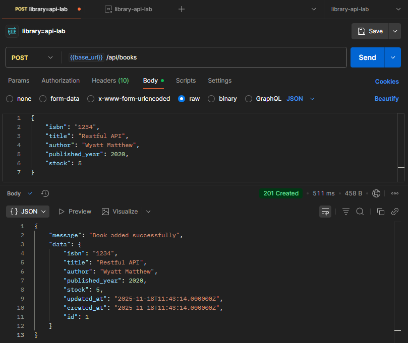
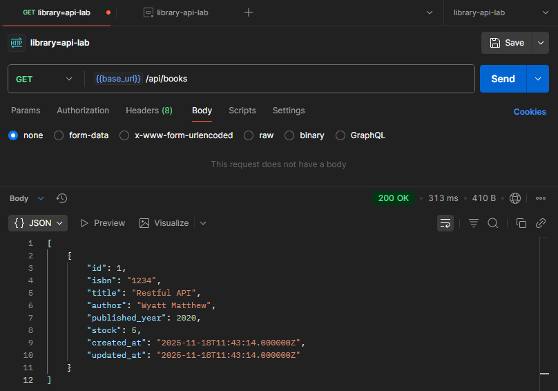
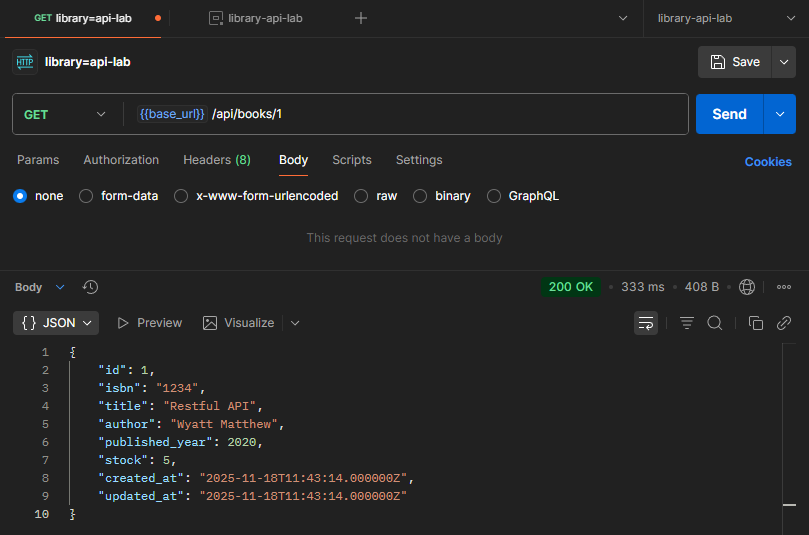
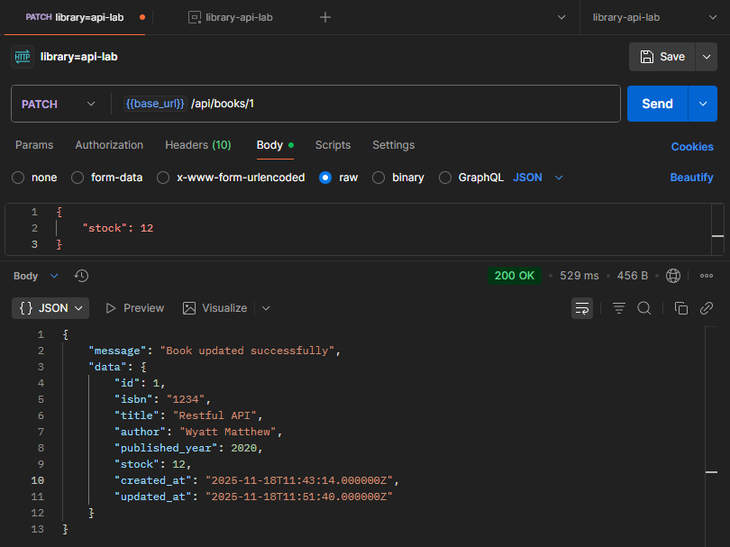
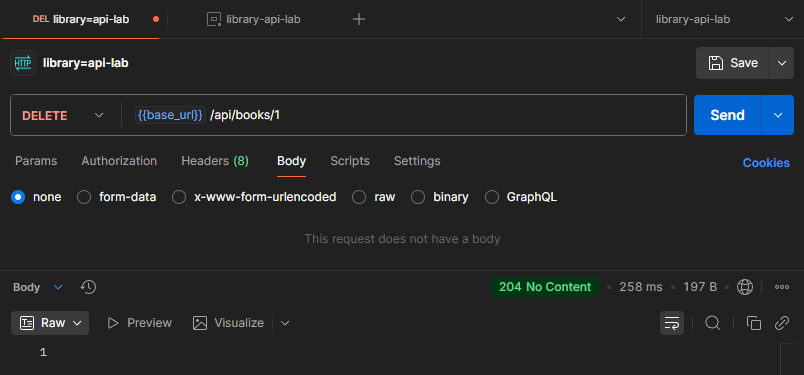
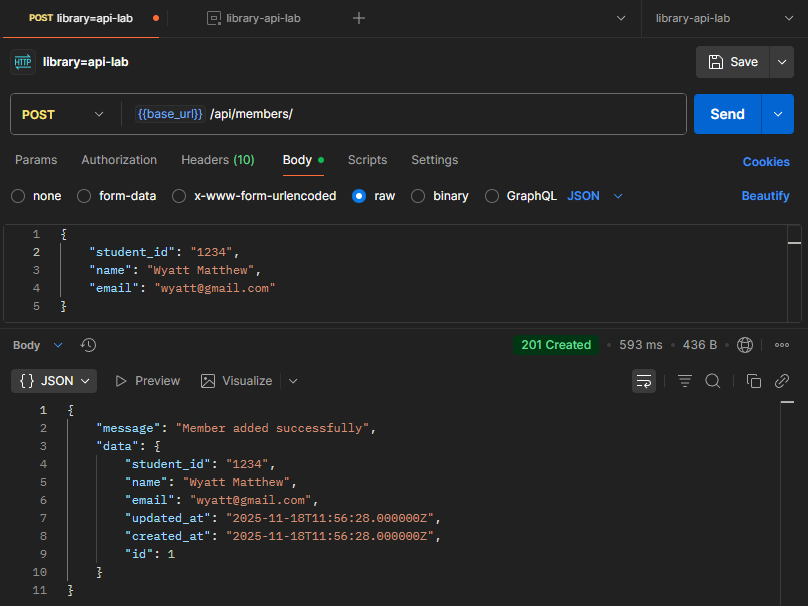
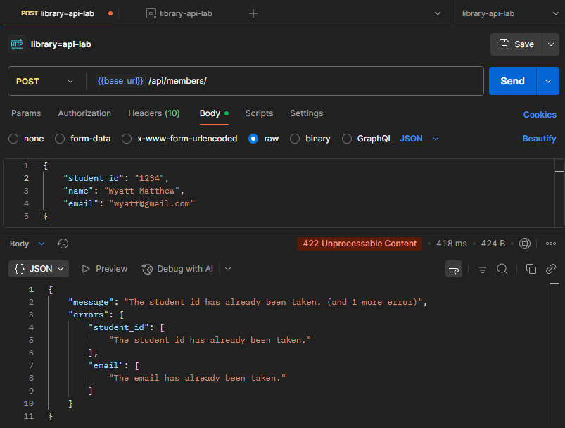
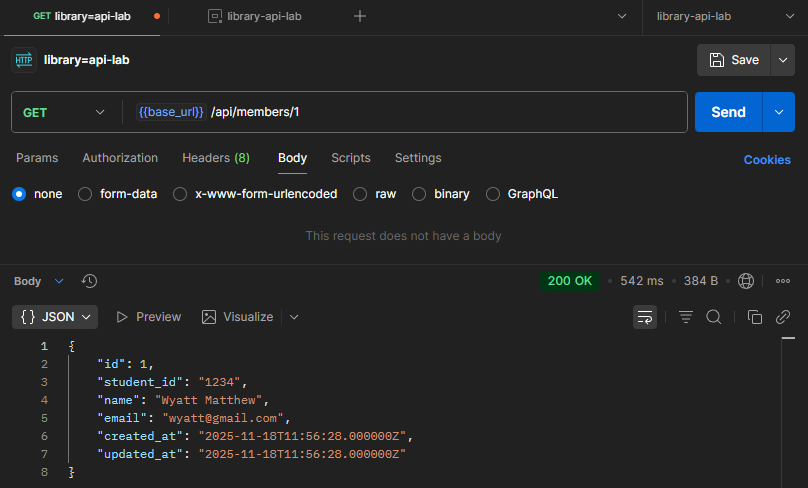
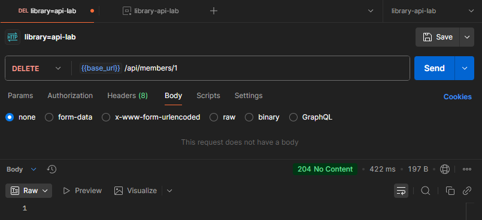

# Docs

## Buku

- POST /api/books

- GET /api/books

- GET /api/books/1

- PATCH /api/books/1

- DELETE /api/books/1

## Anggota

- POST /api/members

- POST /api/members (duplicate)

- GET /api/members/1

- DELETE /api/members/1

